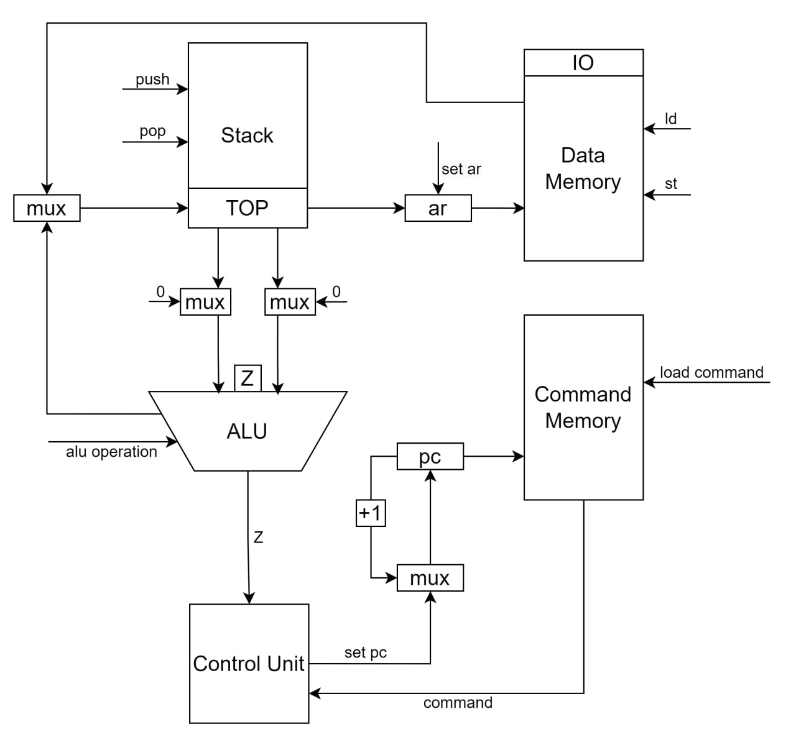
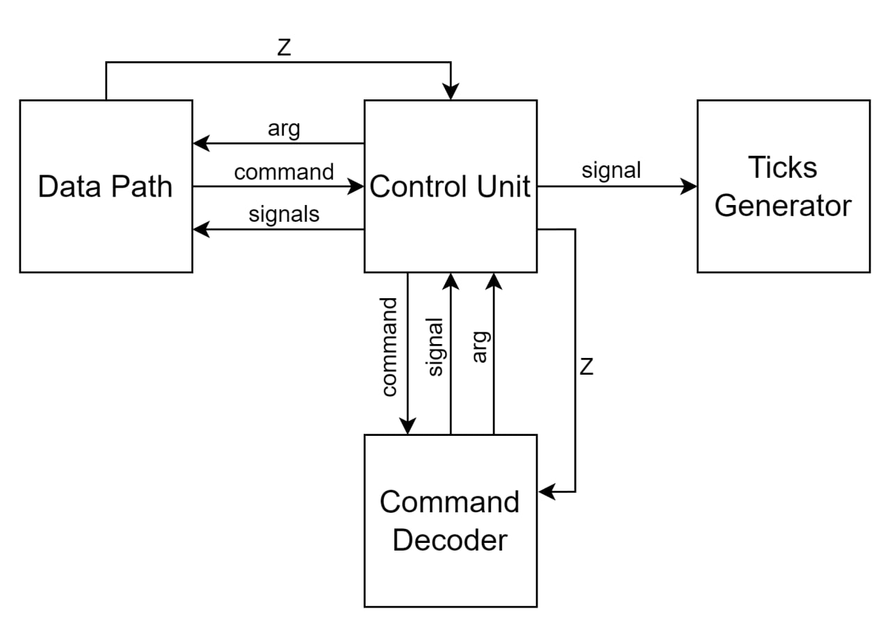

# Лабораторная работа №3

- Шубин Илья Васильевич, P3333
- ```asm | stack | harv | hw | instr | struct | stream | mem | cstr | prob1 | cache```
- Упрощенный вариант

## Язык программирования
### Синтаксис

Форма Бэкуса—Наура:
``` ebnf
<program> ::= [<data>] <code>
	
<data> ::=
	".data" [<comment>] "\n" {<data_definition>}
<data_definition> ::=
	<label> <value> [<number>] [<comment>] "\n"
	
<code> ::= 
	".code" [<comment>] "\n" {<code_definition>}
<code_definition> ::=
	<no_operand_command> [<comment>] "\n"
	| <operand_command> <label> [<comment>] "\n"
	| <label>
	
<no_operand_command> ::= 
	"test" | "pop" | "ld"
	| "st" | "inc" | "jmp"
	| "jz" | "jnz" | "hlt" 
	| "div" | "sub" | "mul"
	| "add" | "xor" | "swap"
<operand_command> ::=
	"push" <label>
	
<label> ::= <word> ": "
<value> ::= <number> | "'"<word>"'"
<comment> ::= ";" {<word> | <number>}

<word> ::= <letter> {<letter> | <int>}
<number> ::= ["-"] <int> {<int>}

<letter> ::= "a" | "b" | "c" | ... | "z" | "A" | "B" | ... | "Z" | "?" | "!" | "." | ","
<int> ::= "0" | "1" | "2" | ... | "9"
```
```hlt``` : остановка программы  
```jmp``` : безусловный переход к команде по адресу с вершины стека  
```jz``` : переход к команде по адресу с вершины стека, если поставлен Z флаг   
```jnz``` : переход к команде по адресу с вершины стека, если Z флаг не поставлен  
```push label``` : положить адрес метки на вершину стека  
```pop``` : убрать значение с вершины стека  
```swap``` : поменять две верхних значения стека местами  
```ld``` : положить на стек значение по адресу с вершины стека   
```st``` : записать по адресу с вершины стека следующее после него значение  
```inc``` : инкрементировать значение на вершине стека  
```add``` : найти сумму двух чисел  
```sub``` : найти разность двух чисел  
```mul``` : найти произведение двух чисел  
```div``` : найти частное двух чисел  
```xor``` : побитовая операция исключающее ИЛИ
```test``` : выставить Z флаг по вершине стека

### Особенности  
- последовательное выполнение
- строки автоматически конвертируются в cstring
- адреса меток видны везде, так как проставляются транслятором
- поддерживаются комментарии, начинающиеся с символа ``;``
- типизация отсутствует
- для пользовательского ввода необходимо заранее выделить место в памяти

## Организация памяти
- Гарвардская архитектура
  - Операнд - 32 бита
  - Память команд: хранит команды и их аргументы, отформатированные на этапе транслятора
  - Память данных: хранит значения строк и переменных, также через заранее определенный порт осуществляется работа с IO
  - команды и данные записываются в память начиная с первой ячейки
- Взаимодействие с данными происходит при помощи команд ```st``` и ```ld```
- Адресация:
  - прямая абсолютная (команда ```push```)
  - косвенная (команды ```st``` и ```ld```)
- Для использования переменных выделен стек, имеется доступ только к вершине стека
  - стек поддерживает команды ```push``` и ```pop```
- Для обращения к ячейкам памяти используются регистры
  - pc - для обращения к памяти команд
  - ar - для обращения к памяти данных

```
          Data memory
+------------------------------+
| 00 : value 1                 |
|   ...                        |
|  n : value n                 |
|   ...                        |
+------------------------------+

         Command memory
+------------------------------+
| 00  : command 1              |
|    ...                       |
|  n  : command n              |
|    ...                       |
+------------------------------+
```

## Система команд
Особенности процессора
- Машинное слово - 32 бита
- IO отображено в памяти и имеет адрес 0х3ff (может быть изменено hardcod'ом)
- Работа с данным осуществляется через стек, добавляются командой ```push``` или ```ld```
- Поток управления:
  - Условные (```jz``` и ```jnz```) и безусловные (```jmp```) переходы
  - Регистр pc инкриминируется после исполнения каждой инструкции

| Инструкция | Кол-во тактов |
|------------|---------------|
| ```test``` | 1             |
| ```pop```  | 1             |
| ```ld```   | 2             |
| ```st```   | 3             |
| ```inc```  | 1             |
| ```jmp```  | 2             |
| ```jz```   | 1(2)          |
| ```jnz```  | 1(2)          |
| ```div```  | 2             |
| ```xor```  | 2             |
| ```mul```  | 2             |
| ```hlt```  | 1             |
| ```add```  | 2             | 
| ```push``` | 1             |
| ```swap``` | 3             |

### Кодирование команд
```json
  {
    "code": "push",
    "arg": 14
  }
```
где
- code - это код команды
- arg - аргумент команды (если отсутствует - ```null```)

### Кодирование данных
```json
  [
    1023,
    32
  ]
```

## Транслятор
Интерфейс командной строки: ```python translator.py <command_file> <data_file> <code_file>```

Этапы трансляции:
1) Удаление комментариев и лишних пробелов
2) Трансляция кода в инструкции
3) Подстановка меток в инструкции

Правила трансляции:
- Каждая инструкция на новой строке
- Использовать можно только существующие метки
Реализован в модуле ```translator.py```

## Процессор

Интерфейс командной строки: ```python machine.py <code_file> <data_file> <input_file>```

Реализован в модуле ```machine.py```

### DataPath


Реализован в классе ```DataPath```

```data_memory``` - память данных  
````command_memory```` - память комманд

Сигналы реализованы в виде методов класса:

- ```set_pc``` - установить значение в ```pc```
- ```set_ar``` - установить значение в ```ar```
- ```load_command``` - загрузить команду по адресу ```pc``` из ```command_memory```
- ```ld``` - прочитать значение из ```data_memory``` по адресу ar
- ```st``` - сохранить в память по адресу с вершины стека следующее значение со стека
- ```pop``` - убрать значение со стека
- ```push``` - положить значение на верх стека
  Флаги:
- ```Z``` - флаг нуля

### Control Unit


Реализовано в классе ```ControlUnit```

- Настраивает стартовое состояние машины: устанавливает регистры, инициализирует памяти
- метод ```next_tick``` инкриминирует количество тактов
- Выполнение и декодирование инструкций происходит в методе ```decode_and_execute_command```

- Моделирование осуществляется в функции execute
- Шаг моделирования соответствует выполнению команды с выводом в журнал
- Для ведения журнала исполнения команд используется logging
- Последняя команда hlt - остановка тактового генератора

## Тестирование
- Тестирование выполняется при помощи golden test-ов.
- Настройка golden тестирования находится в ```test.py```
- Конфигурация golden test-ов лежит в '''tests'''


## Пример использования и журнал работы процессора
```python translator.py files/asm/prob1.asm files/machine_code/prob1_data.json files/machine_code/prob1_code.json```
```python machine.py files/machine_code/prob1_code.json files/machine_code/prob1_data.json files/io/output.txt```

```
TICK:    0 PC:   0 AR:    0 Z_FLAG: 0  COMMAND: {'code': 'push', 'arg': 0}      DATA: 999    STACK: []
TICK:    3 PC:   1 AR:    0 Z_FLAG: 0  COMMAND: {'code': 'ld', 'arg': None}     DATA: 999    STACK: [0]
TICK:    7 PC:   2 AR:    0 Z_FLAG: 1  COMMAND: {'code': 'push', 'arg': 3}      DATA: 999    STACK: [0, 999]
TICK:   10 PC:   3 AR:    0 Z_FLAG: 1  COMMAND: {'code': 'ld', 'arg': None}     DATA: 999    STACK: [0, 999, 3]
TICK:   14 PC:   4 AR:    3 Z_FLAG: 0  COMMAND: {'code': 'swap', 'arg': None}   DATA: 5      STACK: [0, 999, 3, 5]
TICK:   19 PC:   5 AR:    3 Z_FLAG: 0  COMMAND: {'code': 'pop', 'arg': None}    DATA: 5      STACK: [0, 999, 5, 3]
TICK:   22 PC:   6 AR:    3 Z_FLAG: 0  COMMAND: {'code': 'swap', 'arg': None}   DATA: 5      STACK: [0, 999, 5]
TICK:   27 PC:   7 AR:    3 Z_FLAG: 0  COMMAND: {'code': 'div', 'arg': None}    DATA: 5      STACK: [0, 5, 999]
TICK:   31 PC:   8 AR:    3 Z_FLAG: 0  COMMAND: {'code': 'inc', 'arg': None}    DATA: 5      STACK: [0, 199]
TICK:   34 PC:   9 AR:    3 Z_FLAG: 0  COMMAND: {'code': 'swap', 'arg': None}   DATA: 5      STACK: [0, 200]
TICK:   39 PC:  10 AR:    3 Z_FLAG: 1  COMMAND: {'code': 'ld', 'arg': None}     DATA: 5      STACK: [200, 0]
TICK:   43 PC:  11 AR:    0 Z_FLAG: 1  COMMAND: {'code': 'push', 'arg': 3}      DATA: 999    STACK: [200, 0, 999]
TICK:   46 PC:  12 AR:    0 Z_FLAG: 1  COMMAND: {'code': 'ld', 'arg': None}     DATA: 999    STACK: [200, 0, 999, 3]
TICK:   50 PC:  13 AR:    3 Z_FLAG: 0  COMMAND: {'code': 'swap', 'arg': None}   DATA: 5      STACK: [200, 0, 999, 3, 5]
TICK:   55 PC:  14 AR:    3 Z_FLAG: 0  COMMAND: {'code': 'pop', 'arg': None}    DATA: 5      STACK: [200, 0, 999, 5, 3]
TICK:   58 PC:  15 AR:    3 Z_FLAG: 0  COMMAND: {'code': 'swap', 'arg': None}   DATA: 5      STACK: [200, 0, 999, 5]
TICK:   63 PC:  16 AR:    3 Z_FLAG: 0  COMMAND: {'code': 'div', 'arg': None}    DATA: 5      STACK: [200, 0, 5, 999]
TICK:   67 PC:  17 AR:    3 Z_FLAG: 0  COMMAND: {'code': 'swap', 'arg': None}   DATA: 5      STACK: [200, 0, 199]
TICK:   72 PC:  18 AR:    3 Z_FLAG: 1  COMMAND: {'code': 'pop', 'arg': None}    DATA: 5      STACK: [200, 199, 0]
TICK:   75 PC:  19 AR:    3 Z_FLAG: 1  COMMAND: {'code': 'mul', 'arg': None}    DATA: 5      STACK: [200, 199]
TICK:   79 PC:  20 AR:    3 Z_FLAG: 0  COMMAND: {'code': 'push', 'arg': 1}      DATA: 5      STACK: [39800]
TICK:   82 PC:  21 AR:    3 Z_FLAG: 0  COMMAND: {'code': 'ld', 'arg': None}     DATA: 5      STACK: [39800, 1]
TICK:   86 PC:  22 AR:    1 Z_FLAG: 0  COMMAND: {'code': 'swap', 'arg': None}   DATA: 2      STACK: [39800, 1, 2]
TICK:   91 PC:  23 AR:    1 Z_FLAG: 0  COMMAND: {'code': 'pop', 'arg': None}    DATA: 2      STACK: [39800, 2, 1]
TICK:   94 PC:  24 AR:    1 Z_FLAG: 0  COMMAND: {'code': 'swap', 'arg': None}   DATA: 2      STACK: [39800, 2]
TICK:   99 PC:  25 AR:    1 Z_FLAG: 0  COMMAND: {'code': 'div', 'arg': None}    DATA: 2      STACK: [2, 39800]
TICK:  103 PC:  26 AR:    1 Z_FLAG: 0  COMMAND: {'code': 'push', 'arg': 3}      DATA: 2      STACK: [19900]
TICK:  106 PC:  27 AR:    1 Z_FLAG: 0  COMMAND: {'code': 'ld', 'arg': None}     DATA: 2      STACK: [19900, 3]
TICK:  110 PC:  28 AR:    3 Z_FLAG: 0  COMMAND: {'code': 'swap', 'arg': None}   DATA: 5      STACK: [19900, 3, 5]
TICK:  115 PC:  29 AR:    3 Z_FLAG: 0  COMMAND: {'code': 'pop', 'arg': None}    DATA: 5      STACK: [19900, 5, 3]
TICK:  118 PC:  30 AR:    3 Z_FLAG: 0  COMMAND: {'code': 'mul', 'arg': None}    DATA: 5      STACK: [19900, 5]
TICK:  122 PC:  31 AR:    3 Z_FLAG: 0  COMMAND: {'code': 'push', 'arg': 0}      DATA: 5      STACK: [99500]
TICK:  125 PC:  32 AR:    3 Z_FLAG: 0  COMMAND: {'code': 'ld', 'arg': None}     DATA: 5      STACK: [99500, 0]
TICK:  129 PC:  33 AR:    0 Z_FLAG: 1  COMMAND: {'code': 'push', 'arg': 2}      DATA: 999    STACK: [99500, 0, 999]
TICK:  132 PC:  34 AR:    0 Z_FLAG: 1  COMMAND: {'code': 'ld', 'arg': None}     DATA: 999    STACK: [99500, 0, 999, 2]
TICK:  136 PC:  35 AR:    2 Z_FLAG: 0  COMMAND: {'code': 'swap', 'arg': None}   DATA: 3      STACK: [99500, 0, 999, 2, 3]
TICK:  141 PC:  36 AR:    2 Z_FLAG: 0  COMMAND: {'code': 'pop', 'arg': None}    DATA: 3      STACK: [99500, 0, 999, 3, 2]
TICK:  144 PC:  37 AR:    2 Z_FLAG: 0  COMMAND: {'code': 'swap', 'arg': None}   DATA: 3      STACK: [99500, 0, 999, 3]
TICK:  149 PC:  38 AR:    2 Z_FLAG: 0  COMMAND: {'code': 'div', 'arg': None}    DATA: 3      STACK: [99500, 0, 3, 999]
TICK:  153 PC:  39 AR:    2 Z_FLAG: 0  COMMAND: {'code': 'inc', 'arg': None}    DATA: 3      STACK: [99500, 0, 333]
TICK:  156 PC:  40 AR:    2 Z_FLAG: 0  COMMAND: {'code': 'swap', 'arg': None}   DATA: 3      STACK: [99500, 0, 334]
TICK:  161 PC:  41 AR:    2 Z_FLAG: 1  COMMAND: {'code': 'ld', 'arg': None}     DATA: 3      STACK: [99500, 334, 0]
TICK:  165 PC:  42 AR:    0 Z_FLAG: 1  COMMAND: {'code': 'push', 'arg': 2}      DATA: 999    STACK: [99500, 334, 0, 999]
TICK:  168 PC:  43 AR:    0 Z_FLAG: 1  COMMAND: {'code': 'ld', 'arg': None}     DATA: 999    STACK: [99500, 334, 0, 999, 2]
TICK:  172 PC:  44 AR:    2 Z_FLAG: 0  COMMAND: {'code': 'swap', 'arg': None}   DATA: 3      STACK: [99500, 334, 0, 999, 2, 3]
TICK:  177 PC:  45 AR:    2 Z_FLAG: 0  COMMAND: {'code': 'pop', 'arg': None}    DATA: 3      STACK: [99500, 334, 0, 999, 3, 2]
TICK:  180 PC:  46 AR:    2 Z_FLAG: 0  COMMAND: {'code': 'swap', 'arg': None}   DATA: 3      STACK: [99500, 334, 0, 999, 3]
TICK:  185 PC:  47 AR:    2 Z_FLAG: 0  COMMAND: {'code': 'div', 'arg': None}    DATA: 3      STACK: [99500, 334, 0, 3, 999]
TICK:  189 PC:  48 AR:    2 Z_FLAG: 0  COMMAND: {'code': 'swap', 'arg': None}   DATA: 3      STACK: [99500, 334, 0, 333]
TICK:  194 PC:  49 AR:    2 Z_FLAG: 1  COMMAND: {'code': 'pop', 'arg': None}    DATA: 3      STACK: [99500, 334, 333, 0]
TICK:  197 PC:  50 AR:    2 Z_FLAG: 1  COMMAND: {'code': 'mul', 'arg': None}    DATA: 3      STACK: [99500, 334, 333]
TICK:  201 PC:  51 AR:    2 Z_FLAG: 0  COMMAND: {'code': 'push', 'arg': 1}      DATA: 3      STACK: [99500, 111222]
TICK:  204 PC:  52 AR:    2 Z_FLAG: 0  COMMAND: {'code': 'ld', 'arg': None}     DATA: 3      STACK: [99500, 111222, 1]
TICK:  208 PC:  53 AR:    1 Z_FLAG: 0  COMMAND: {'code': 'swap', 'arg': None}   DATA: 2      STACK: [99500, 111222, 1, 2]
TICK:  213 PC:  54 AR:    1 Z_FLAG: 0  COMMAND: {'code': 'pop', 'arg': None}    DATA: 2      STACK: [99500, 111222, 2, 1]
TICK:  216 PC:  55 AR:    1 Z_FLAG: 0  COMMAND: {'code': 'swap', 'arg': None}   DATA: 2      STACK: [99500, 111222, 2]
TICK:  221 PC:  56 AR:    1 Z_FLAG: 0  COMMAND: {'code': 'div', 'arg': None}    DATA: 2      STACK: [99500, 2, 111222]
TICK:  225 PC:  57 AR:    1 Z_FLAG: 0  COMMAND: {'code': 'push', 'arg': 2}      DATA: 2      STACK: [99500, 55611]
TICK:  228 PC:  58 AR:    1 Z_FLAG: 0  COMMAND: {'code': 'ld', 'arg': None}     DATA: 2      STACK: [99500, 55611, 2]
TICK:  232 PC:  59 AR:    2 Z_FLAG: 0  COMMAND: {'code': 'swap', 'arg': None}   DATA: 3      STACK: [99500, 55611, 2, 3]
TICK:  237 PC:  60 AR:    2 Z_FLAG: 0  COMMAND: {'code': 'pop', 'arg': None}    DATA: 3      STACK: [99500, 55611, 3, 2]
TICK:  240 PC:  61 AR:    2 Z_FLAG: 0  COMMAND: {'code': 'mul', 'arg': None}    DATA: 3      STACK: [99500, 55611, 3]
TICK:  244 PC:  62 AR:    2 Z_FLAG: 0  COMMAND: {'code': 'add', 'arg': None}    DATA: 3      STACK: [99500, 166833]
TICK:  248 PC:  63 AR:    2 Z_FLAG: 0  COMMAND: {'code': 'push', 'arg': 0}      DATA: 3      STACK: [266333]
TICK:  251 PC:  64 AR:    2 Z_FLAG: 0  COMMAND: {'code': 'ld', 'arg': None}     DATA: 3      STACK: [266333, 0]
TICK:  255 PC:  65 AR:    0 Z_FLAG: 1  COMMAND: {'code': 'push', 'arg': 4}      DATA: 999    STACK: [266333, 0, 999]
TICK:  258 PC:  66 AR:    0 Z_FLAG: 1  COMMAND: {'code': 'ld', 'arg': None}     DATA: 999    STACK: [266333, 0, 999, 4]
TICK:  262 PC:  67 AR:    4 Z_FLAG: 0  COMMAND: {'code': 'swap', 'arg': None}   DATA: 15     STACK: [266333, 0, 999, 4, 15]
TICK:  267 PC:  68 AR:    4 Z_FLAG: 0  COMMAND: {'code': 'pop', 'arg': None}    DATA: 15     STACK: [266333, 0, 999, 15, 4]
TICK:  270 PC:  69 AR:    4 Z_FLAG: 0  COMMAND: {'code': 'swap', 'arg': None}   DATA: 15     STACK: [266333, 0, 999, 15]
TICK:  275 PC:  70 AR:    4 Z_FLAG: 0  COMMAND: {'code': 'div', 'arg': None}    DATA: 15     STACK: [266333, 0, 15, 999]
TICK:  279 PC:  71 AR:    4 Z_FLAG: 0  COMMAND: {'code': 'inc', 'arg': None}    DATA: 15     STACK: [266333, 0, 66]
TICK:  282 PC:  72 AR:    4 Z_FLAG: 0  COMMAND: {'code': 'swap', 'arg': None}   DATA: 15     STACK: [266333, 0, 67]
TICK:  287 PC:  73 AR:    4 Z_FLAG: 1  COMMAND: {'code': 'ld', 'arg': None}     DATA: 15     STACK: [266333, 67, 0]
TICK:  291 PC:  74 AR:    0 Z_FLAG: 1  COMMAND: {'code': 'push', 'arg': 4}      DATA: 999    STACK: [266333, 67, 0, 999]
TICK:  294 PC:  75 AR:    0 Z_FLAG: 1  COMMAND: {'code': 'ld', 'arg': None}     DATA: 999    STACK: [266333, 67, 0, 999, 4]
TICK:  298 PC:  76 AR:    4 Z_FLAG: 0  COMMAND: {'code': 'swap', 'arg': None}   DATA: 15     STACK: [266333, 67, 0, 999, 4, 15]
TICK:  303 PC:  77 AR:    4 Z_FLAG: 0  COMMAND: {'code': 'pop', 'arg': None}    DATA: 15     STACK: [266333, 67, 0, 999, 15, 4]
TICK:  306 PC:  78 AR:    4 Z_FLAG: 0  COMMAND: {'code': 'swap', 'arg': None}   DATA: 15     STACK: [266333, 67, 0, 999, 15]
TICK:  311 PC:  79 AR:    4 Z_FLAG: 0  COMMAND: {'code': 'div', 'arg': None}    DATA: 15     STACK: [266333, 67, 0, 15, 999]
TICK:  315 PC:  80 AR:    4 Z_FLAG: 0  COMMAND: {'code': 'swap', 'arg': None}   DATA: 15     STACK: [266333, 67, 0, 66]
TICK:  320 PC:  81 AR:    4 Z_FLAG: 1  COMMAND: {'code': 'pop', 'arg': None}    DATA: 15     STACK: [266333, 67, 66, 0]
TICK:  323 PC:  82 AR:    4 Z_FLAG: 1  COMMAND: {'code': 'mul', 'arg': None}    DATA: 15     STACK: [266333, 67, 66]
TICK:  327 PC:  83 AR:    4 Z_FLAG: 0  COMMAND: {'code': 'push', 'arg': 1}      DATA: 15     STACK: [266333, 4422]
TICK:  330 PC:  84 AR:    4 Z_FLAG: 0  COMMAND: {'code': 'ld', 'arg': None}     DATA: 15     STACK: [266333, 4422, 1]
TICK:  334 PC:  85 AR:    1 Z_FLAG: 0  COMMAND: {'code': 'swap', 'arg': None}   DATA: 2      STACK: [266333, 4422, 1, 2]
TICK:  339 PC:  86 AR:    1 Z_FLAG: 0  COMMAND: {'code': 'pop', 'arg': None}    DATA: 2      STACK: [266333, 4422, 2, 1]
TICK:  342 PC:  87 AR:    1 Z_FLAG: 0  COMMAND: {'code': 'swap', 'arg': None}   DATA: 2      STACK: [266333, 4422, 2]
TICK:  347 PC:  88 AR:    1 Z_FLAG: 0  COMMAND: {'code': 'div', 'arg': None}    DATA: 2      STACK: [266333, 2, 4422]
TICK:  351 PC:  89 AR:    1 Z_FLAG: 0  COMMAND: {'code': 'push', 'arg': 4}      DATA: 2      STACK: [266333, 2211]
TICK:  354 PC:  90 AR:    1 Z_FLAG: 0  COMMAND: {'code': 'ld', 'arg': None}     DATA: 2      STACK: [266333, 2211, 4]
TICK:  358 PC:  91 AR:    4 Z_FLAG: 0  COMMAND: {'code': 'swap', 'arg': None}   DATA: 15     STACK: [266333, 2211, 4, 15]
TICK:  363 PC:  92 AR:    4 Z_FLAG: 0  COMMAND: {'code': 'pop', 'arg': None}    DATA: 15     STACK: [266333, 2211, 15, 4]
TICK:  366 PC:  93 AR:    4 Z_FLAG: 0  COMMAND: {'code': 'mul', 'arg': None}    DATA: 15     STACK: [266333, 2211, 15]
TICK:  370 PC:  94 AR:    4 Z_FLAG: 0  COMMAND: {'code': 'swap', 'arg': None}   DATA: 15     STACK: [266333, 33165]
TICK:  375 PC:  95 AR:    4 Z_FLAG: 0  COMMAND: {'code': 'sub', 'arg': None}    DATA: 15     STACK: [33165, 266333]
TICK:  379 PC:  96 AR:    4 Z_FLAG: 0  COMMAND: {'code': 'push', 'arg': 5}      DATA: 15     STACK: [233168]
TICK:  382 PC:  97 AR:    4 Z_FLAG: 0  COMMAND: {'code': 'ld', 'arg': None}     DATA: 15     STACK: [233168, 5]
TICK:  386 PC:  98 AR:    5 Z_FLAG: 0  COMMAND: {'code': 'swap', 'arg': None}   DATA: 1023   STACK: [233168, 5, 1023]
TICK:  391 PC:  99 AR:    5 Z_FLAG: 0  COMMAND: {'code': 'pop', 'arg': None}    DATA: 1023   STACK: [233168, 1023, 5]
TICK:  394 PC: 100 AR:    5 Z_FLAG: 0  COMMAND: {'code': 'st', 'arg': None}     DATA: 1023   STACK: [233168, 1023]
TICK:  402 PC: 101 AR: 1023 Z_FLAG: 0  COMMAND: {'code': 'pop', 'arg': None}    DATA: 0      STACK: [1023]
TICK:  405 PC: 102 AR: 1023 Z_FLAG: 0  COMMAND: {'code': 'hlt', 'arg': None}    DATA: 0      STACK: []
output:  233168
command_counter:  103  number_of_ticks:  407
```

| ФИО                        | <алг>       | <LoC> | <code байт> | <code инстр.> | <инстр.> | <такт.> | <вариант>    |
|----------------------------|-------------|-------|-------------|---------------|----------|---------|--------------|
| Шубин Илья Васильевич      | hello_world | 21    | -           | 15            | 162      | 607     |asm \| stack \| harv \| hw \| instr \| struct \| stream \| mem \| cstr \| prob1 \| cache|
| Шубин Илья Васильевич  | hello_name  | 98    | -           | 83            | 495      | 1869    |asm \| stack \| harv \| hw \| instr \| struct \| stream \| mem \| cstr \| prob1 \| cache|
| Шубин Илья Васильевич  | cat         | 20    | -           | 15            | 247      | 943     |asm \| stack \| harv \| hw \| instr \| struct \| stream \| mem \| cstr \| prob1 \| cache|
| Шубин Илья Васильевич  | prob1       | 111   | -           | 103           | 103      | 407     |asm \| stack \| harv \| hw \| instr \| struct \| stream \| mem \| cstr \| prob1 \| cache|